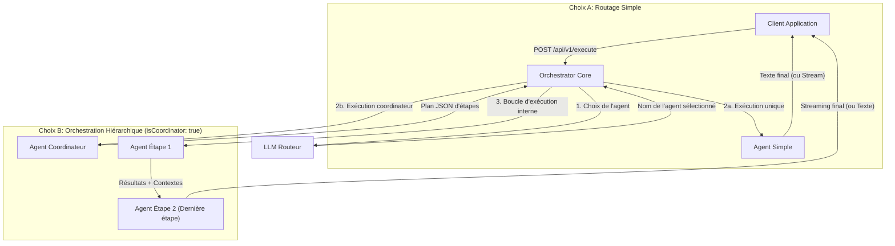

# Agent Orchestrator Core

[](https://nodejs.org/)
[](https://www.typescriptlang.org/)
[](https://www.fastify.io/)
[](https://www.docker.com/)
[](LICENSE)

`agent-orchestrator-core` est un microservice stateless en Node.js/TypeScript.
Il reçoit une requête utilisateur, demande à un agent "routeur" de choisir soit un agent simple spécialisé, soit un agent coordinateur capable de produire un plan JSON d'étapes exécutées séquentiellement en interne.

Le service expose une API HTTP simple, sans persistance de session.

## Why Agent Orchestrator Core?

Most multi-agent frameworks:
- are Python libraries
- must be embedded into an application
- are tightly coupled to a framework or runtime

`agent-orchestrator-core` takes a different approach:
- **Stateless HTTP microservice**: Easy to deploy, scale, and integrate with any programming language.
- **Kubernetes-friendly**: Native container-based architecture with graceful shutdown.
- **Multi-provider**: Mix OpenAI, Mistral, and local endpoints (Ollama, vLLM, etc.) seamlessly in the same workflow.
- **SSE streaming**: Real-time response generation (Server-Sent Events) supported for single agents and sequential flows.
- **Dynamic routing**: Real-time agent selection using structured outputs or robust JSON fallbacks.
- **Hierarchical orchestration**: A coordinator agent can build a sequential multi-step plan dynamically executed by specialized agents.

## Use Cases

- **Medical workflow orchestration**: Route and sequence patient queries to a diagnostic assistant, then to a prescription auditor, and finally to a pharmacy formatter.
- **Customer support routing**: Direct incoming queries to specialized agents (billing, technical, sales) and coordinate multi-step resolutions.
- **Content generation pipelines**: Sieve user ideas through a researcher, copywriter, and editor sequence.
- **Research assistants**: Coordinate multi-source fact checking and report writing.
- **Multi-LLM evaluation**: Route prompts to different models and compile a comparative evaluation report.
- **Internal enterprise copilots**: Connect varied database querying agents and document processors.

## Architecture

Le service s'organise autour d'un routeur et d'agents simples ou coordinateurs exécutés en séquence.



## Fonctionnement

Chaque appel à `POST /api/v1/execute` (ou `/api/v1/execute/stream`) contient :
- le texte utilisateur ;
- un objet de contexte injecté dans les prompts ;
- la configuration du routeur ;
- la liste des agents disponibles.

Flux d'exécution :
1. Le payload est validé.
2. Les variables `{{variable}}` sont injectées dans le prompt système du routeur à partir du `context`.
3. Le routeur choisit un agent et produit un résumé court.
4. **Si l'agent sélectionné est un agent simple** :
   - La variable `{{router_summary}}` est injectée dans son prompt.
   - L'agent répond directement au message de l'utilisateur (avec streaming temps réel en mode `/stream`).
5. **Si l'agent sélectionné est un agent coordinateur** (`isCoordinator: true`) :
   - Le coordinateur produit un plan d'action JSON (conforme au schéma `WorkflowPlanSchema`) contenant une suite d'étapes ordonnées.
   - Le moteur d'orchestration exécute chaque étape séquentiellement en faisant appel à l'agent spécifié pour chaque étape.
   - Les variables contextuelles (`{{router_summary}}` pour la consigne de l'étape et `{{parent_output}}` pour le résultat produit par l'étape précédente) sont injectées dynamiquement.
   - Le résultat final de la dernière étape est renvoyé au client (avec streaming de la toute dernière étape en mode `/stream`).

## Fonctionnalités réellement supportées

1. **Routeur multi-provider** : `openai`, `mistral` ou `local`.
2. **Agents multi-provider** : chaque agent peut utiliser `openai`, `mistral` ou `local`.
3. **Templating simple** : remplacement de variables `{{variable}}` dans les prompts système.
4. **Sortie structurée conditionnelle pour le routeur** :
   le service tente un routage via `response_format: json_schema` uniquement pour `openai` sans `baseUrl` personnalisée.
5. **Fallback JSON-only** :
   dans tous les autres cas, ou si l'appel structuré échoue, le routeur est réinterrogé avec une consigne demandant un objet JSON brut.
6. **Stateless** : aucune session n'est conservée côté service.
7. **Garde-fous optionnels** :
   Bearer token côté API et allowlist de `baseUrl`.

## Variables d'environnement

Le service charge automatiquement un fichier `.env` à la racine si le fichier existe.
En conteneur, les variables peuvent aussi être injectées directement.

```env
# Réseau
HOST=0.0.0.0
PORT=3000
NODE_ENV=development

# Providers
OPENAI_API_KEY=sk-proj-xxxxxxxxxxxxxxxxxxxxxxxx
MISTRAL_API_KEY=xxxxxxxxxxxxxxxxxxxxxxxx

# Optionnel pour les endpoints locaux compatibles OpenAI
LOCAL_LLM_API_KEY=ollama

# Sécurité API optionnelle
ORCHESTRATOR_API_TOKEN=change-me

# Sécurité des baseUrl dynamiques
# Si ENFORCE_BASE_URL_ALLOWLIST=true, toute baseUrl fournie dans le payload
# pour un routeur ou un agent doit être présente dans ALLOWED_BASE_URLS.
ENFORCE_BASE_URL_ALLOWLIST=false
ALLOWED_BASE_URLS=http://localhost:11434/v1,https://api.mistral.ai/v1
```

## Règles provider

- `openai` :
  utilise `OPENAI_API_KEY`. `baseUrl` est optionnelle.
- `mistral` :
  utilise `MISTRAL_API_KEY`. `baseUrl` est optionnelle.
  Si elle est absente, le service utilise `https://api.mistral.ai/v1`.
- `local` :
  utilise `LOCAL_LLM_API_KEY` si défini, sinon `ollama`.
  `baseUrl` est obligatoire dans le payload.

## Lancement local

Installer les dépendances :

```bash
npm install
```

Lancer le serveur de développement :

```bash
npm start
```

Le service démarre par défaut sur `http://localhost:3000`.

## Build production

```bash
npm run build
NODE_ENV=production node dist/server.js
```

## Docker

Construction :

```bash
docker build -t agent-orchestrator-core .
```

Exécution :

```bash
docker run -d \
  --name agent-orchestrator \
  -p 3000:3000 \
  --env-file .env \
  agent-orchestrator-core
```

## API

### GET `/health`

Réponse :

```json
{
  "status": "UP"
}
```

### POST `/api/v1/execute`

Si `ORCHESTRATOR_API_TOKEN` est défini, envoyer aussi :

```text
Authorization: Bearer <token>
```

Exemple :

```bash
curl -X POST http://localhost:3000/api/v1/execute \
  -H "Content-Type: application/json" \
  -H "Authorization: Bearer change-me" \
  -d '{
    "inputText": "Jʼai besoin dʼaide pour résoudre lʼéquation suivante: 3x + 5 = 20",
    "context": {
      "student_name": "Jean",
      "grade": "4ème"
    },
    "routerConfig": {
      "name": "Router",
      "model": "gpt-4o-mini",
      "provider": "openai",
      "systemPrompt": "Tu es un agent routeur pour lʼélève {{student_name}} (classe: {{grade}}). Analyse son problème et choisis lʼagent le plus pertinent entre Maths et Francais.",
      "temperature": 0
    },
    "agentsConfig": [
      {
        "name": "Maths",
        "model": "gpt-4o-mini",
        "provider": "openai",
        "systemPrompt": "Tu es un tuteur bienveillant en mathématiques pour {{student_name}} (classe de {{grade}}). Tu as reçu ce résumé de la demande : {{router_summary}}. Aide lʼélève pas à pas sans lui donner directement la réponse.",
        "temperature": 0.4
      },
      {
        "name": "Francais",
        "model": "gpt-4o-mini",
        "provider": "openai",
        "systemPrompt": "Tu es un professeur de français pour {{student_name}} (classe de {{grade}}). Tu as reçu ce résumé de la demande : {{router_summary}}. Aide lʼélève à comprendre les règles de grammaire et dʼorthographe associées.",
        "temperature": 0.3
      }
    ]
  }'
```

Réponse attendue :

```json
{
  "outputText": "Bonjour Jean ! Pour commencer, quelle opération peux-tu faire des deux côtés pour supprimer le +5 ?"
}
```

### Exemple d'Orchestration Hiérarchique (Agence de Presse)

Cet exemple met en évidence la puissance de l'orchestrateur. Un agent **Coordinateur-Presse** délègue et enchaîne le travail entre un **Chercheur**, un **Redacteur** et un **Traducteur** pour produire un article journalistique fini et traduit en anglais, le tout en une seule requête stateless.

```bash
curl -X POST http://localhost:3000/api/v1/execute \
  -H "Content-Type: application/json" \
  -H "Authorization: Bearer change-me" \
  -d '{
    "inputText": "Rédiger un court article sur la découverte de glace dʼeau sur Mars et le traduire en anglais.",
    "context": {
      "editor_name": "LʼÉcho du Cosmos"
    },
    "routerConfig": {
      "name": "Directeur-Publication",
      "model": "gpt-4o-mini",
      "provider": "openai",
      "systemPrompt": "Tu es le directeur de publication de {{editor_name}}. Analyse la demande et oriente-la vers lʼagent compétent parmi [Coordinateur-Presse, Maths]. Pour toute rédaction journalistique, choisis Coordinateur-Presse.",
      "temperature": 0
    },
    "agentsConfig": [
      {
        "name": "Coordinateur-Presse",
        "model": "gpt-4o-mini",
        "provider": "openai",
        "systemPrompt": "Tu es le coordinateur de lʼagence de presse. Crée un plan dʼaction JSON en 3 étapes pour répondre à la demande de lʼutilisateur. Tu dois utiliser obligatoirement lʼagent Chercheur en premier, puis lʼagent Redacteur, puis lʼagent Traducteur. Retourne uniquement ce format JSON : {\"steps\": [{\"agent\": \"Chercheur\", \"instruction\": \"Collecter 3 faits marquants sur la glace dʼeau sur Mars\"}, {\"agent\": \"Redacteur\", \"instruction\": \"Rédiger un article journalistique de 2 paragraphes basé sur les faits\"}, {\"agent\": \"Traducteur\", \"instruction\": \"Traduire lʼarticle en anglais\"}]}",
        "temperature": 0.1,
        "isCoordinator": true
      },
      {
        "name": "Chercheur",
        "model": "gpt-4o-mini",
        "provider": "openai",
        "systemPrompt": "Tu es chercheur pour {{editor_name}}. Ta consigne : {{router_summary}}. Liste les faits sous forme de puces.",
        "temperature": 0.2
      },
      {
        "name": "Redacteur",
        "model": "gpt-4o-mini",
        "provider": "openai",
        "systemPrompt": "Tu es rédacteur pour {{editor_name}}. Ta consigne : {{router_summary}}. Rédige lʼarticle en te basant exclusivement sur les données du chercheur : {{parent_output}}.",
        "temperature": 0.5
      },
      {
        "name": "Traducteur",
        "model": "gpt-4o-mini",
        "provider": "openai",
        "systemPrompt": "Tu es traducteur bilingue. Ta consigne : {{router_summary}}. Traduis le texte suivant en anglais : {{parent_output}}.",
        "temperature": 0.1
      }
    ]
  }'
```

Réponse finale attendue (l'article traduit en anglais issu de la séquence d'agents) :

```json
{
  "outputText": "Water Ice Discovered on Mars!\n\nRecent scientific findings have confirmed the presence of water ice just beneath the Martian surface. This discovery opens new possibilities for future crewed missions, as this ice could potentially be harvested for drinking water and fuel production.\n\nFurthermore, the ice sheets provide a geological record of Mars' climate history, helping scientists understand the planet's past habitability. Excitement is building within the space community as researchers plan further exploration of these ice-rich regions."
}
```

### POST `/api/v1/execute/stream`

Identique à `/api/v1/execute` mais renvoie la réponse sous forme de flux **Server-Sent Events (SSE)**.

En-têtes SSE générés :
- `Content-Type: text/event-stream`
- `Cache-Control: no-cache`
- `Connection: keep-alive`

Types d'événements (events) retournés :
1. `event: status` : envoyé dès que la phase de routage est terminée. Indique l'agent sélectionné et le résumé.
   ```json
   {
     "selectedAgent": "Maths",
     "summary": "Résolution d'équation"
   }
   ```
2. `event: token` : fragments de texte envoyés au fil de l'eau par l'agent.
   ```json
   {
     "text": "Bonjour"
   }
   ```
3. `event: done` : indique la fin de la génération.
   ```text
   [DONE]
   ```
4. `event: error` : si une erreur survient au milieu du flux (après l'envoi des en-têtes).
   ```json
   {
     "message": "Description de l'erreur"
   }
   ```

*Note* : Si une erreur survient avant le début de la génération (ex: erreur de routage ou clé API manquante), l'API renvoie directement une réponse HTTP `500 Internal Server Error` au format JSON classique.

## Payload

```json
{
  "inputText": "string",
  "context": {},
  "routerConfig": {
    "name": "string",
    "model": "string",
    "provider": "openai | mistral | local",
    "baseUrl": "https://...",
    "systemPrompt": "string",
    "temperature": 0.35,
    "isCoordinator": false
  },
  "agentsConfig": [
    {
      "name": "string",
      "model": "string",
      "provider": "openai | mistral | local",
      "baseUrl": "https://...",
      "systemPrompt": "string",
      "temperature": 0.35,
      "isCoordinator": false
    }
  ]
}
```

Contraintes validées côté API :
- `inputText` est obligatoire.
- `context` doit être un objet.
- `routerConfig` est obligatoire.
- `agentsConfig` doit contenir au moins un agent.
- les noms d'agents doivent être uniques.
- `baseUrl`, si fournie, doit être une URL valide.
- `baseUrl` est obligatoire pour `local`.
- `temperature` doit être comprise entre `0` et `2`.
- `isCoordinator` est un booléen optionnel (par défaut `false`). Si activé, le service s'attend à ce que l'agent retourne un plan JSON et l'exécutera sous forme de workflow séquentiel interne.

## Comportement de routage

Le routeur doit retourner un objet JSON avec cette forme :

```json
{
  "targetAgent": "NomDeLAgent",
  "summary": "Résumé court"
}
```

Notes utiles :
- `targetAgent` doit correspondre à un nom présent dans `agentsConfig`.
- la correspondance du nom de l'agent est tolérante à la casse ;
- si le routeur retourne du JSON entouré de balises Markdown, le service tente d'extraire l'objet JSON.

## Gestion des erreurs

- `400 Bad Request` :
  payload invalide.
- `401 Unauthorized` :
  token Bearer manquant ou invalide quand `ORCHESTRATOR_API_TOKEN` est configuré.
- `500 Internal Server Error` :
  erreur provider, erreur de routage ou problème de configuration.

En environnement non production, la réponse `500` inclut un champ `details`.
En `production`, la réponse reste volontairement plus générique.

## Roadmap

- [x] Multi-provider routing (OpenAI, Mistral, Local)
- [x] Hierarchical agent orchestration
- [x] SSE streaming (Real-time token and status chunks)
- [ ] Parallel step execution
- [ ] OpenTelemetry Integration
- [ ] Prometheus metrics (token counts, latencies)
- [ ] Retry policies (resiliency against LLM provider failures)
- [ ] Model Context Protocol (MCP) support
- [ ] Helm Chart for Kubernetes deployments
