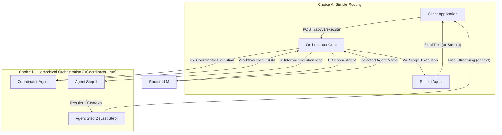

# Agent Orchestrator Core

[](https://nodejs.org/)
[](https://www.typescriptlang.org/)
[](https://www.fastify.io/)
[](https://www.docker.com/)
[](LICENSE)

`agent-orchestrator-core` is a stateless Node.js/TypeScript microservice.
It receives user requests, queries a "router" agent to select either a specialized simple agent or a coordinator agent capable of producing a JSON plan of steps to be executed sequentially.

The service exposes a simple HTTP API without session persistence.

## Why Agent Orchestrator Core?

Most multi-agent frameworks:
- are Python libraries
- must be embedded into an application
- are tightly coupled to a framework or runtime

`agent-orchestrator-core` takes a different approach:
- **Stateless HTTP microservice**: Easy to deploy, scale, and integrate with any programming language.
- **Kubernetes-friendly**: Native container-based architecture with graceful shutdown.
- **Multi-provider**: Mix OpenAI, Mistral, and local endpoints (Ollama, vLLM, etc.) seamlessly in the same workflow.
- **SSE streaming**: Real-time response generation (Server-Sent Events) supported for single agents and sequential flows.
- **Dynamic routing**: Real-time agent selection using structured outputs or robust JSON fallbacks.
- **Hierarchical orchestration**: A coordinator agent can build a sequential multi-step plan dynamically executed by specialized agents.

## Use Cases

- **Medical workflow orchestration**: Route and sequence patient queries to a diagnostic assistant, then to a prescription auditor, and finally to a pharmacy formatter.
- **Customer support routing**: Direct incoming queries to specialized agents (billing, technical, sales) and coordinate multi-step resolutions.
- **Content generation pipelines**: Sieve user ideas through a researcher, copywriter, and editor sequence.
- **Research assistants**: Coordinate multi-source fact checking and report writing.
- **Multi-LLM evaluation**: Route prompts to different models and compile a comparative evaluation report.
- **Internal enterprise copilots**: Connect varied database querying agents and document processors.

## Architecture

The service is organized around a router and simple or coordinator agents executed in sequence.



## How it Works

Each call to `POST /api/v1/execute` (or `/api/v1/execute/stream`) contains:
- the user's input text;
- a context object injected into the prompts;
- the router's configuration;
- the list of available agents.

Execution flow:
1. The payload is validated.
2. The `{{variable}}` templates in the router's system prompt are replaced with values from the `context`.
3. The router selects an agent and generates a short summary.
4. **If the selected agent is a simple agent**:
   - The variable `{{router_summary}}` is injected into its prompt.
   - The agent responds directly to the user's message (with real-time streaming in `/stream` mode).
5. **If the selected agent is a coordinator agent** (`isCoordinator: true`):
   - The coordinator produces a JSON action plan (conforming to `WorkflowPlanSchema`) listing a series of ordered steps.
   - The orchestrator engine executes each step sequentially, calling the specified agent for each step.
   - Context variables (`{{router_summary}}` for the step instruction and `{{parent_output}}` for the result of the previous step) are dynamically injected.
   - The final result of the last step is returned to the client (with real-time streaming of the final step in `/stream` mode).

## Key Features

1. **Multi-Provider Router**: Use `openai`, `mistral`, or `local`.
2. **Multi-Provider Agents**: Each agent can run on its own provider (`openai`, `mistral`, or `local`).
3. **Simple Templating**: Replaces `{{variable}}` templates in system prompts with custom context.
4. **Conditional Structured Output for the Router**: Uses `response_format: json_schema` (strict mode) only for official `openai` endpoints without a custom `baseUrl` to save latency.
5. **JSON-only Fallback**: In all other cases (or if structured routing fails), queries the router with a prompt demanding a raw JSON object.
6. **Stateless**: No session state is persisted on the service.
7. **Optional Guardrails**: Bearer token authentication and base URL allowlist.

## Environment Variables

The service automatically loads a `.env` file at the root if it exists.
In a container, variables can be injected directly as environment variables.

```env
# Network
HOST=0.0.0.0
PORT=3000
NODE_ENV=development

# LLM Providers
OPENAI_API_KEY=sk-proj-xxxxxxxxxxxxxxxxxxxxxxxx
MISTRAL_API_KEY=xxxxxxxxxxxxxxxxxxxxxxxx

# Optional for local OpenAI-compatible endpoints
LOCAL_LLM_API_KEY=ollama

# Optional API Security Token
ORCHESTRATOR_API_TOKEN=change-me

# Security: Dynamic Base URL Allowlist
# If ENFORCE_BASE_URL_ALLOWLIST=true, any baseUrl provided in the payload
# for a router or agent must be listed in ALLOWED_BASE_URLS.
ENFORCE_BASE_URL_ALLOWLIST=false
ALLOWED_BASE_URLS=http://localhost:11434/v1,https://api.mistral.ai/v1
```

## Provider Rules

- `openai`:
  Uses `OPENAI_API_KEY`. `baseUrl` is optional.
- `mistral`:
  Uses `MISTRAL_API_KEY`. `baseUrl` is optional.
  If omitted, defaults to `https://api.mistral.ai/v1`.
- `local`:
  Uses `LOCAL_LLM_API_KEY` if defined, otherwise defaults to `ollama`.
  `baseUrl` is mandatory in the payload.

## Getting Started

### Local Setup

Install dependencies:
```bash
npm install
```

Start the development server:
```bash
npm start
```
The service starts on `http://localhost:3000` by default.

### Production Build

```bash
npm run build
NODE_ENV=production node dist/server.js
```

### Docker

Build the image:
```bash
docker build -t agent-orchestrator-core .
```

Run the container:
```bash
docker run -d \
  --name agent-orchestrator \
  -p 3000:3000 \
  --env-file .env \
  agent-orchestrator-core
```

## API Reference

### GET `/health`

Response:
```json
{
  "status": "UP"
}
```

### POST `/api/v1/execute`

If `ORCHESTRATOR_API_TOKEN` is configured, send the header:
```text
Authorization: Bearer <token>
```

#### Simple Agent Routing Example

```bash
curl -X POST http://localhost:3000/api/v1/execute \
  -H "Content-Type: application/json" \
  -H "Authorization: Bearer change-me" \
  -d '{
    "inputText": "I need help solving this equation: 3x + 5 = 20",
    "context": {
      "student_name": "John",
      "grade": "8th Grade"
    },
    "routerConfig": {
      "name": "Router",
      "model": "gpt-4o-mini",
      "provider": "openai",
      "systemPrompt": "You are a router agent for student {{student_name}} (grade: {{grade}}). Analyze the request and route to the most appropriate agent: [Math, English].",
      "temperature": 0
    },
    "agentsConfig": [
      {
        "name": "Math",
        "model": "gpt-4o-mini",
        "provider": "openai",
        "systemPrompt": "You are a friendly math tutor for {{student_name}} (grade: {{grade}}). You received this routing summary: {{router_summary}}. Help the student step-by-step without giving the answer directly.",
        "temperature": 0.4
      },
      {
        "name": "English",
        "model": "gpt-4o-mini",
        "provider": "openai",
        "systemPrompt": "You are an English teacher for {{student_name}} (grade: {{grade}}). You received this routing summary: {{router_summary}}. Help the student understand grammar and writing rules.",
        "temperature": 0.3
      }
    ]
  }'
```

Expected Response:
```json
{
  "outputText": "Hello John! Let's solve this together. What is the first step to isolate the x term? What operation can we apply to both sides to remove the +5?"
}
```

#### Hierarchical Orchestration Example (Press Agency)

This example shows the power of the orchestrator. A **Coordinator-Press** agent delegates and chains the workflow across a **Researcher**, a **Writer**, and a **Translator** to produce a completed and translated news article in a single stateless request.

```bash
curl -X POST http://localhost:3000/api/v1/execute \
  -H "Content-Type: application/json" \
  -H "Authorization: Bearer change-me" \
  -d '{
    "inputText": "Write a short article about water ice discoveries on Mars and translate it to English.",
    "context": {
      "editor_name": "Cosmic Chronicles"
    },
    "routerConfig": {
      "name": "Editor-In-Chief",
      "model": "gpt-4o-mini",
      "provider": "openai",
      "systemPrompt": "You are the editor-in-chief of {{editor_name}}. Analyze the request and route it to the appropriate agent among [Coordinator-Press, Math]. For any writing tasks, choose Coordinator-Press.",
      "temperature": 0
    },
    "agentsConfig": [
      {
        "name": "Coordinator-Press",
        "model": "gpt-4o-mini",
        "provider": "openai",
        "systemPrompt": "You are the press coordinator. Create a 3-step action plan in JSON to fulfill the user request. You must run the Researcher agent first, then the Writer agent, then the Translator agent. Return only this JSON format: {\"steps\": [{\"agent\": \"Researcher\", \"instruction\": \"Collect 3 key facts about water ice on Mars\"}, {\"agent\": \"Writer\", \"instruction\": \"Write a 2-paragraph news article based on the facts\"}, {\"agent\": \"Translator\", \"instruction\": \"Translate the article to English\"}]}",
        "temperature": 0.1,
        "isCoordinator": true
      },
      {
        "name": "Researcher",
        "model": "gpt-4o-mini",
        "provider": "openai",
        "systemPrompt": "You are a researcher for {{editor_name}}. Your instruction: {{router_summary}}. List findings as bullet points.",
        "temperature": 0.2
      },
      {
        "name": "Writer",
        "model": "gpt-4o-mini",
        "provider": "openai",
        "systemPrompt": "You are a journalist for {{editor_name}}. Your instruction: {{router_summary}}. Write the article based strictly on these facts: {{parent_output}}.",
        "temperature": 0.5
      },
      {
        "name": "Translator",
        "model": "gpt-4o-mini",
        "provider": "openai",
        "systemPrompt": "You are a translator. Your instruction: {{router_summary}}. Translate the following text to English: {{parent_output}}.",
        "temperature": 0.1
      }
    ]
  }'
```

Expected Response (final article translated to English):
```json
{
  "outputText": "Water Ice Discovered on Mars!\n\nRecent scientific findings have confirmed the presence of water ice just beneath the Martian surface. This discovery opens new possibilities for future crewed missions, as this ice could potentially be harvested for drinking water and fuel production.\n\nFurthermore, the ice sheets provide a geological record of Mars' climate history, helping scientists understand the planet's past habitability. Excitement is building within the space community as researchers plan further exploration of these ice-rich regions."
}
```

#### LLM-as-a-Judge Evaluation Example

This example demonstrates the "LLM-as-a-Judge" pattern. A **Judge-Coordinator** creates a sequential workflow where a **Writer** generates content, and a **Critic** evaluates the generated content based on specific criteria before returning the final scorecard.

```bash
curl -X POST http://localhost:3000/api/v1/execute \
  -H "Content-Type: application/json" \
  -H "Authorization: Bearer change-me" \
  -d '{
    "inputText": "Draft a short pitch for a new AI coding assistant.",
    "context": {
      "evaluation_rubric": "Clarity of value proposition, conciseness, and presence of a call to action."
    },
    "routerConfig": {
      "name": "Router",
      "model": "gpt-4o-mini",
      "provider": "openai",
      "systemPrompt": "You are a router. Route this request to the Judge-Coordinator.",
      "temperature": 0
    },
    "agentsConfig": [
      {
        "name": "Judge-Coordinator",
        "model": "gpt-4o-mini",
        "provider": "openai",
        "systemPrompt": "You are a coordinator. Create a 2-step plan: Step 1 uses the agent \"Writer\" to draft the pitch. Step 2 uses the agent \"Critic\" to evaluate the draft. Return only this JSON structure: {\"steps\": [{\"agent\": \"Writer\", \"instruction\": \"Write a 1-paragraph elevator pitch for the AI coding assistant\"}, {\"agent\": \"Critic\", \"instruction\": \"Evaluate the pitch using criteria: {{evaluation_rubric}}\"}]}",
        "temperature": 0.1,
        "isCoordinator": true
      },
      {
        "name": "Writer",
        "model": "gpt-4o-mini",
        "provider": "openai",
        "systemPrompt": "You are a marketing copywriter. Write a 1-paragraph pitch based on the instruction: {{router_summary}}.",
        "temperature": 0.7
      },
      {
        "name": "Critic",
        "model": "gpt-4o-mini",
        "provider": "openai",
        "systemPrompt": "You are a senior editor acting as a judge. Read the pitch draft: {{parent_output}}. Grade it based on: {{router_summary}}. Output a score out of 10, explain your reasoning, and list specific feedback.",
        "temperature": 0.2
      }
    ]
  }'
```

Expected Response:
```json
{
  "outputText": "### Evaluation Score: 9/10\n\n**Reasoning:**\n- **Clarity of value proposition:** Excellent. The pitch clearly highlights how the assistant solves developers' bottlenecks.\n- **Conciseness:** Very good. It fits into a single, punchy paragraph.\n- **Call to action:** Present and clear.\n\n**Suggestions for improvement:**\n- Consider making the call to action slightly more urgent (e.g., adding 'Get started free today')."
}
```

### POST `/api/v1/execute/stream`

Identical to `/api/v1/execute` but returns the response as a **Server-Sent Events (SSE)** stream.

SSE Headers:
- `Content-Type: text/event-stream`
- `Cache-Control: no-cache`
- `Connection: keep-alive`

Event types returned:
1. `event: status`: Sent as soon as the routing phase completes. Indicates the selected agent and the summary.
   ```json
   {
     "selectedAgent": "Math",
     "summary": "Equation solving help"
   }
   ```
2. `event: token`: Text fragments streamed in real-time by the active agent.
   ```json
   {
     "text": "Hello"
   }
   ```
3. `event: done`: Indicates the stream has finished.
   ```text
   [DONE]
   ```
4. `event: error`: Sent if an error occurs mid-stream (after headers are sent).
   ```json
   {
     "message": "Error details"
   }
   ```

*Note*: If an error occurs before streaming starts (e.g., routing failure or missing API key), the API returns a standard `500 Internal Server Error` JSON payload.

## Payload Structure

```json
{
  "inputText": "string",
  "context": {},
  "routerConfig": {
    "name": "string",
    "model": "string",
    "provider": "openai | mistral | local",
    "baseUrl": "https://...",
    "systemPrompt": "string",
    "temperature": 0.35,
    "isCoordinator": false
  },
  "agentsConfig": [
    {
      "name": "string",
      "model": "string",
      "provider": "openai | mistral | local",
      "baseUrl": "https://...",
      "systemPrompt": "string",
      "temperature": 0.35,
      "isCoordinator": false
    }
  ]
}
```

API Validation Constraints:
- `inputText` is required.
- `context` must be an object.
- `routerConfig` is required.
- `agentsConfig` must contain at least one agent configuration.
- Agent names must be unique.
- `baseUrl`, if provided, must be a valid URL.
- `baseUrl` is mandatory when `provider` is `local`.
- `temperature` must be between `0` and `2`.
- `isCoordinator` is an optional boolean (defaulting to `false`). If enabled, the service expects the agent to return a JSON workflow plan, which it will then execute sequentially.

## Routing Behavior

The router must return a JSON object with the following shape:

```json
{
  "targetAgent": "AgentName",
  "summary": "Short summary"
}
```

Useful Notes:
- `targetAgent` must match a name defined in `agentsConfig`.
- Agent name matching is case-insensitive.
- If the router returns JSON wrapped in Markdown code fences, the service automatically extracts the JSON object.

## Error Handling

- `400 Bad Request`: Invalid payload.
- `401 Unauthorized`: Missing or invalid Bearer token when `ORCHESTRATOR_API_TOKEN` is configured.
- `500 Internal Server Error`: Provider error, routing error, or configuration issue.

In non-production environments, the `500` error response includes a `details` field. In `production` mode, the error response remains generic for security.

## Roadmap

- [x] Multi-provider routing (OpenAI, Mistral, Local)
- [x] Hierarchical agent orchestration
- [x] SSE streaming (Real-time token and status chunks)
- [ ] Parallel step execution
- [ ] OpenTelemetry Integration
- [ ] Prometheus metrics (token counts, latencies)
- [ ] Retry policies (resiliency against LLM provider failures)
- [ ] Model Context Protocol (MCP) support
- [ ] Helm Chart for Kubernetes deployments
